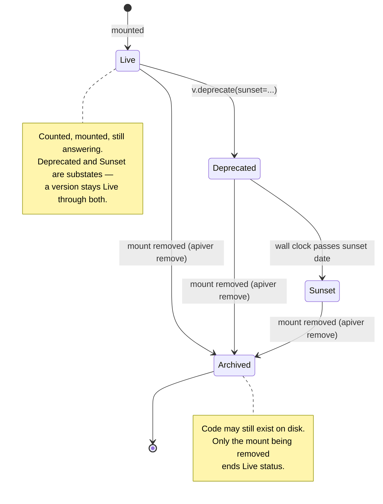

# Version Lifecycle

A version doesn't just get built once and forgotten — it moves through a lifecycle from the day it's
mounted to the day it's finally cut loose. apiver treats every stage as an explicit state, not an
implied one:



## Deprecation and sunset

A version's lifecycle lives on the `Version` object itself — never in settings, never only in the
manifest — so there's exactly one source of truth:

```python
from datetime import datetime, timezone

v1.deprecate(sunset=datetime(2027, 1, 1, tzinfo=timezone.utc))
```

From that point on, every response `v1` serves carries `Deprecation: true` and `Sunset: <HTTP-date>`
headers. Once the sunset date passes — checked on the wall clock, per request, not baked in at deploy
time — `v1` starts returning `410 Gone` with DRF's ordinary `{"detail": ...}` body instead of reaching
the view. A version stays **Live** (counted, mounted, still answering) through both `Deprecated` and
past-`Sunset` states; it only becomes **Archived** once its mount is actually removed from the URLconf.

A movable, client-facing name — `stable`, `latest` — is a separate concept, an `Alias`, not another
version:

```console
$ apiver alias stable --from v2
```

Re-pointing `stable` at a future `v3` is a one-line `target=` edit in the generated Aggregation Root;
callers of `/api/stable/...` never have to change anything.

## Squashing a long delta chain

Long delta chains are the natural worry with a deltas-forward design — by `v12`, is the inheritance
chain still maintainable? `apiver squash` is the answer, and it's mechanical rather than clever:
because a version's root can hold nothing but `registry.py` (see [Philosophy](../philosophy.md)), squash
only ever flattens routing declarations — it never touches a View or Serializer's source, so there's no
codemod risk to review.

```console
$ apiver squash v3
wrote .../apiversions/v3/registry.py
apiver: 'v3's registry.py now explicitly overrides every route it inherited from v1, v2 — its parent
chain is unchanged. `apiver remove v2` is what will cut that link, one ancestor at a time, working back
through the chain.
```

`apiver squash v3` walks `v3`'s *whole* ancestor chain (however deep — not just its immediate parent)
and rewrites `v3/registry.py` from scratch: every route it resolves — including whatever it only ever
inherited implicitly — becomes an explicit `override()` call (`register()` would raise: the parent
chain still resolves that key, unchanged), and any route `v3` removed along the way is re-declared with
an explicit `remove()` too, so nothing about what `v3` actually serves changes. **`v3`'s parent link
itself is left exactly as it was** — squash makes a version's own file a complete, honest description
of what it serves, without restructuring the chain underneath it. It's auto-applied — there's no
`--apply` flag or staged output to promote — because the change is small enough that `git diff` is a
complete review surface on its own.

Before it writes anything, squash re-checks every absorbed version against the registry-only rule from
Philosophy and refuses, listing every violation at once, if any of them fail it:

```console
$ apiver squash v3
apiver: squash refuses to run — every absorbed version must satisfy ADR 0003's ticket #77 rule
(registry.py only, no inline definitions) before it can be safely folded away:
- version 'v1's apiversions/v1/registry.py defines ['InlineWidgetView'] inline — ...
```

**Squash never deletes anything, and it never touches the parent chain.** `v1` and `v2` stay exactly
where they are, still imported, still live — `v3`'s `registry.py` is just now explicit about everything
it already serves. `APIVER_MAX_LIVE_VERSIONS` (default **3**) is the warning that tells you it's time
to start thinking about archiving one of them; see
[ADR 0009](https://github.com/edraobdu/apiver/blob/master/docs/adr/0009-squash-design.md) for the full
design.

## Archiving a squashed-away version

Once every direct child of a version already resolves its entire contribution explicitly — via a prior
`apiver squash` — that version is safe to archive. `apiver remove` is the operation that actually does
it: a version stays **Live** through both `Deprecated` and past-`Sunset` states; it only becomes
**Archived** once its mount is removed.

```console
$ apiver remove v1
wrote .../apiversions/v2/registry.py
wrote .../apiversions/urls.py
apiver: v2 is now an independent Base Version — 'v1's parent link has been cut.
apiver: 'v1' is now Archived — drop it from APIVER_VERSIONS in settings.py, then `git rm -r` its
directory once you've confirmed nothing else needs it.
```

`apiver remove v1` rewrites every direct child's `registry.py` itself — cutting the `.derive('v1')`
line and flipping every `override()` that targeted a key `v1` introduced into `register()` — and drops
`v1`'s mount from the Aggregation Root's `urls.py`. If `v1` had branched into more than one child, each
becomes its own independent Base Version; apiver's model already tolerates more than one.

It refuses, writing nothing, if any direct child doesn't yet explicitly resolve everything `v1`
contributes:

```console
$ apiver remove v1
apiver: remove refuses to run — every direct child of 'v1' must already resolve its entire contribution
explicitly (via a prior `apiver squash`) before its mount can be cut:
- 'v2' does not yet explicitly resolve every key 'v1' contributes — missing ['payments']. Run `apiver
  squash v2` first.
```

It also refuses a version that was never deprecated — no `Deprecation`/`Sunset` headers were ever sent
to callers — unless `--force` is passed; pulling a mount out from under live callers with no prior
warning needs an explicit override.

**`remove` never deletes a directory itself, and it never edits `settings.py`.** Both stay hand-edits:
drop the archived version from `APIVER_VERSIONS` yourself, then `git rm -r` its directory once you've
confirmed nothing else needs it — an accidental deletion of source code is a different order of risk
than a rewritten text file.
