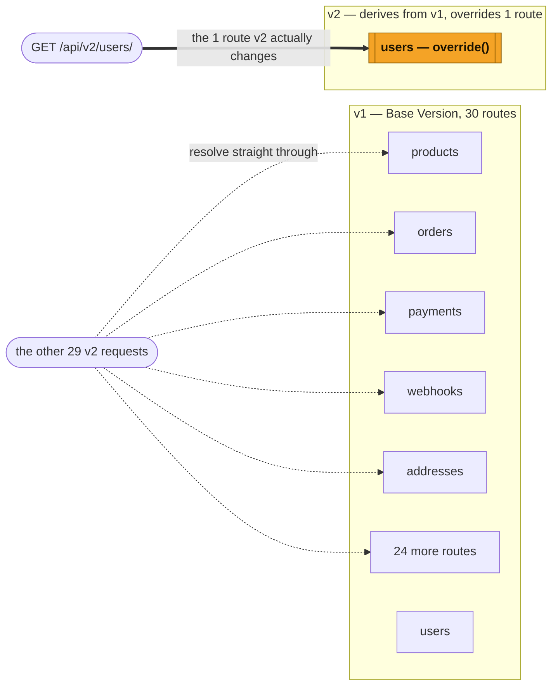

# apiver

**Define API versions as deltas, not duplicates.**

Your existing code becomes the **base version**, exactly where it already lives. Every later version
declares only what changed against its parent — one `override()` call — and everything else resolves
straight through to the same handler objects the parent already uses. Not copies. The same objects.

`v2` mentions exactly one thing: `users`. Every other route — 29 of them, across 6 resources — resolves
straight through to the exact same `v1` handler objects, untouched.

## Nothing to reorganize first

1. **Install it.** `uv add apiver` (or `pip install apiver`).
2. **Add two settings.** Where versions mount, and which ones are live.
3. **Run `apiver init --base v1`.** It reads your existing routes and writes the registry for you.
4. **Add one line to your root `urls.py`.**

That's it. Your existing API is now also live at `/api/v1/...`, serving the exact same handlers it
always did — nothing moved, nothing got rewritten. [Walk through it end to end, commands and output
included →](getting-started.md)

## The problem

A Django REST Framework project needs to ship a breaking API change — drop a field, remove a resource,
change a type — without breaking the clients still calling the old shape. Every available answer today
is bad in a specific way:

- **Copy the API into a `v2/` package.** The 5% that actually changed drags the other 95% along with
  it. Every later bug fix has to be applied N times, the copies drift silently, and nobody can tell by
  reading the code which parts of V2 are a deliberate change and which are a stale duplicate that nobody
  noticed diverging.
- **Reach for DRF's built-in versioning.** `URLPathVersioning` sets `request.version` and stops there.
  There's no fallback and no composition, so the developer hand-writes `if request.version == "v2":`
  branches scattered through views, serializers and querysets — versioning logic smeared across the
  codebase instead of declared in one place. Sometimes it's dressed up as a converter function between
  versions instead of a branch; it's the same disease wearing a different hat — logic that decides what
  changed, living anywhere except the one place a reviewer would think to look.
- **Promise to only ever add, never remove.** No branch, no override, no version — just pile
  `status_v2`, `status_string`, and `status_do_not_use` next to the field nobody had the nerve to
  schedule a real removal for. Two years in, the response body is an archaeology dig, and no client
  developer can tell you which field they're actually supposed to read.

None of these give you a way to say *"V2 is V1, except payments returns decimal strings and
legacy-invoices is gone"* and get a **complete, correctly-documented V2 API surface** out of it — nor do
they let you answer, at a glance, months later: what does `v3` actually serve? Which routes does it
inherit rather than define? Is the published OpenAPI document for `v2` still accurate? Did anyone
remember to tell clients `v1` is going away?

And none of them require the mess to already exist before it's worth fixing. However your project got
here — a single clean version or a decade of hand-rolled ones — apiver only needs to know what your
*next* version changes. See [What If...?](what-if.md) for the adoption objections this raises in
practice.

## Philosophy

**Messy URL patterns are a symptom, not the disease.** By the time a project has a `views_v2.py`, a
`serializers_v2_actually_final.py`, and three different `if version ==` conditionals guarding the same
queryset, the underlying problem isn't the file layout — it's that nothing in the codebase can say what
changed between versions and what didn't. apiver forces that question to be answered explicitly, once,
at the one place a version's behavior is actually decided: `register()`, `override()`, `remove()`.

apiver is also deliberately narrow: three verbs, one direction of inheritance, loud failures on misuse.
Nothing tries to be flexible enough to accommodate every way a team might want to version an API; it
tries to be narrow enough that there's exactly one obvious way, and it happens to be correct. Read the
[full Philosophy](philosophy.md) for the rest of it — including the one place apiver draws a hard line
that's what makes squashing a long delta chain mechanical rather than risky.

## What you get

- **A second complete API surface for the cost of one field.** One `override()` call, and
  `GET /api/v2/products/` still works — V2 never mentioned products, and the other 29 routes were never
  touched.
- **`apiver init` wraps your project exactly as it is.** No file moves, no big-bang migration to
  schedule. The first breaking change is the only time you touch apiver again.
- **Deltas that are ordinary, inspectable Python.** An override is a subclass. No DSL, no parallel
  object model, no migration-chain classes to learn — if you can read a Django class hierarchy, you can
  read a delta.
- **Correct per-version OpenAPI, automatically.** Each version's schema document contains exactly its
  own routes — no leakage from siblings, no hand-maintained schema file to keep in sync.
- **Lifecycle clients can actually see.** `v1.deprecate(sunset=...)` emits real `Deprecation`/`Sunset`
  headers and enforces `410 Gone` on the wall clock — no deploy has to land on the date.
- **Tooling that answers "what does v3 actually serve?"** `apiver versions` and a committed
  `apiver.toml` turn that from an archaeology project into a command.
- **No pretending it can see what it can't.** A `SerializerMethodField`'s actual output, or a changed
  error-response shape, won't show up in a schema diff — `apiver diff` says so out loud instead of
  quietly missing it. [See exactly where the line is →](supported.md).

## Status and roadmap

apiver is pre-1.0. The mechanism, verbs, and CLI documented across this site exist and are covered by
tests — none of it is a design document describing something aspirational. What isn't settled yet is
everything below: expect the public API to keep moving until a tagged `0.1` release, and pin an exact
version if you adopt apiver before then.

**0.1 is the complete tool**, not a minimal one — everything below ships before the first tag, not after
it:

- **[A version-wide config layer](https://github.com/edraobdu/apiver/issues/57).** Still a decision
  ticket, not a build ticket: whether `Version` should support version-wide configuration
  (`permission_classes`, authentication) that forwards to every route without an explicit `override()`
  per endpoint. Today's workaround — overriding each affected endpoint explicitly — stays the documented
  path unless this lands with a real mechanism behind it.

**apiver will never relocate your existing files** — see [Philosophy](philosophy.md). `apiver init`
discovers and imports code from wherever it already lives; that boundary doesn't move as the tool
matures, it's a permanent design decision, not a gap waiting on a `--move` flag.

**1.0 is a stability gate, not a new-feature milestone.** It means the public API — the verbs, the CLI,
the settings — has held under real adoption without a breaking change, not that new mechanism was added
to earn the tag.

**Post-1.0, and only once a real second-framework need justifies it — FastAPI, Quart and Litestar
adapters.** apiver's public namespace is `apiver.drf`, not flat `apiver`, precisely so this stays
possible without a breaking rename later. There is deliberately no `apiver.core` abstraction layer built
ahead of a second framework actually needing one — building that layer speculatively, before a real
adapter has stressed it, is exactly the kind of premature flexibility [Philosophy](philosophy.md) argues
against.

## Where to go next

- **New to apiver?** Start with [Getting Started](getting-started.md) — a real adoption walkthrough,
  commands and output included verbatim.
- **Evaluating whether it fits your project?** [What If...?](what-if.md) answers the specific objections
  an adoption decision actually raises.
- **Want the reasoning, not just the mechanism?** [Philosophy](philosophy.md).
- **Looking for a specific command or setting?** [Reference](reference.md).
